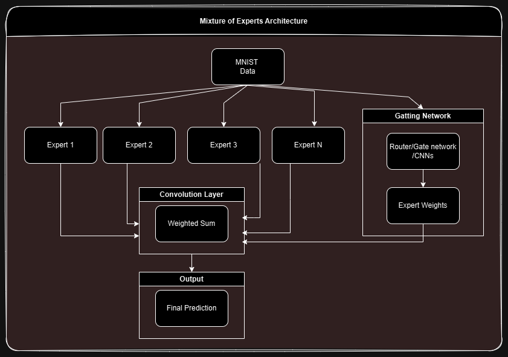

<<<<<<< HEAD
# mixture-of-experts
A simple design for MOE on Mnist data
=======
# MIXTURE OF EXPERTS on MNIST DATA



</div>
 This is a minimalistic project to understand how MOE architectures work. The training and evaluation is done on MNIST data. 
 Using this code you can have a good look at how things run under the hood.

## Key Features

- **Simple python code to run.**  
  - Just run one file and you can see outputs for
  - `models`: Trained models
  - `plots`: MOE activation outputs on epoch and batch number for a deeper understanding 
  - `data`: MOE activation activate as a CSV output


## Setup Instructions

1. **Install Anaconda (Recommended):**  
   [Anaconda Installation Guide](https://docs.anaconda.com/)

2. **Create and Activate the Environment:**
   ```
   conda create -n moe_cnn python=3.10.15
   conda activate moe_cnn
   pip install -r requirements.txt
   ```

## Running the Training

- **Small Dataset (e.g., “Alice in Wonderland”):**
    
    ```
    python main.py
    ```
>>>>>>> d4eb6ff (first commit)
