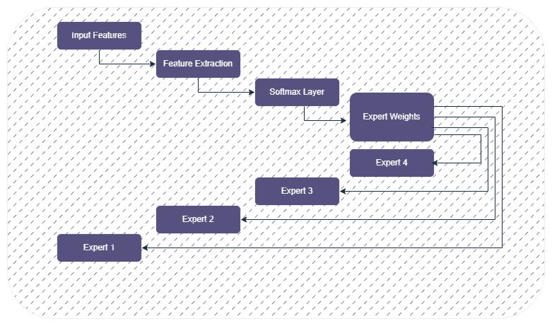
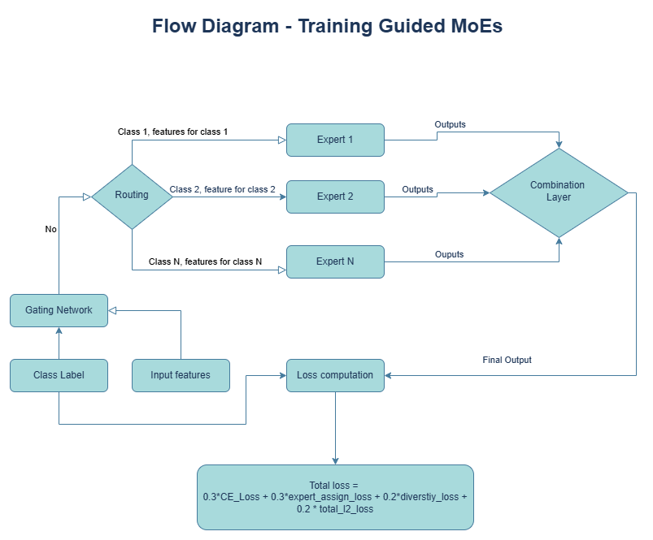
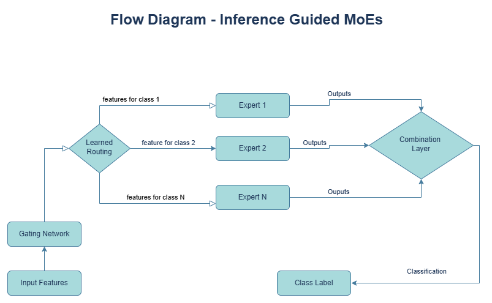
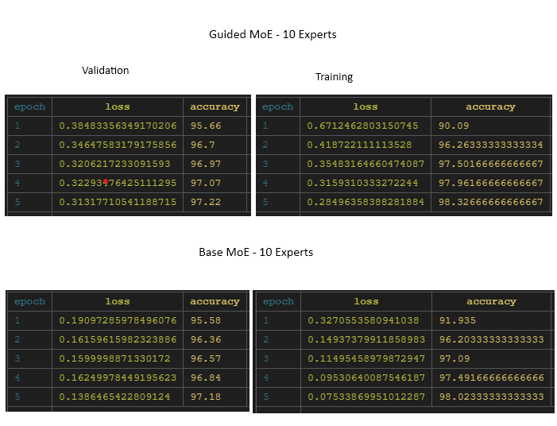
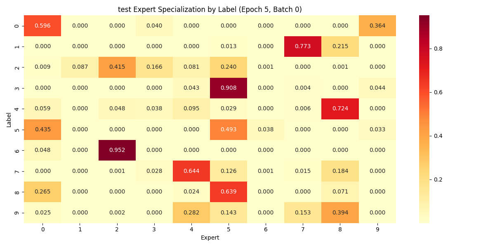
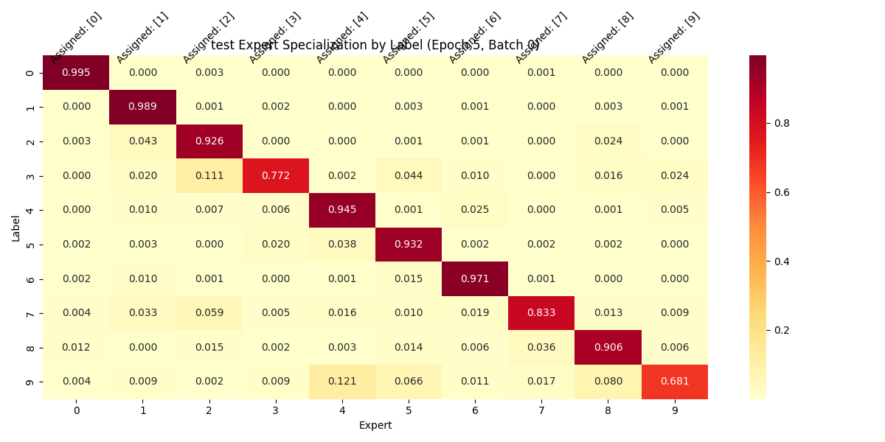

# mixture-of-experts
## A simple design for MOE on Mnist data
=======================================
## MIXTURE OF EXPERTS on MNIST DATA


</div>
 This is a minimalistic project to understand how MOE architectures work. The training and evaluation is done on MNIST data. 
 Using this code you can have a good look at how things run under the hood.

## Key Features

- **Simple python code to run.**  
  - Just run one file and you can see outputs for
  - `models`: Trained models
  - `plots`: MOE activation outputs on epoch and batch number for a deeper understanding 
  - `csv`: MOE activation activate as a CSV output

## Activation of MOE


## Setup Instructions

1. **Install Anaconda (Recommended):**  
   [Anaconda Installation Guide](https://docs.anaconda.com/)

2. **Create and Activate the Environment:**
   ```
   conda create -n moe_cnn python=3.10.15
   conda activate moe_cnn
   pip install -r requirements.txt
   ```

## Running the Training

- **Small Dataset (e.g., “Alice in Wonderland”):**
    
    ```
    python main.py
    ```

## MIXTURE OF GUIDED EXPERTS on MNIST DATA
=======================================

</div>
 Similarly we have a 'guided' of MoE. In this version we use labels to guide the 
 data to handle particular labels. Enforcing expert to only have a expertise 
 towards particular labels.

## Flow Diagram of Gudied MoEs
Labels and features flow into the Gudied MoE and we calcualte 4 different losses - all of them which are weighted. 






## Key Features

- **Simple python code to run.**  
  - Just run one file and you can see outputs for
  - `models`: Trained models
  - `plots`: MOE activation outputs on epoch and batch number for a deeper understanding 
  - `csv`: MOE activation activate as a CSV output


## Results on 10 Mixture of Experts
### Here are the losses and acurracies after 5 epochs



### Assignment heatmaps
How can we verify if the guided MOEs are actually working? Well we 
can visualize the assigments during training and testing. Below are the two assignment maps

#### Base Mixture of Experts



#### Guided Mixture of Experts



From the maps its pretty evident that they guided MoE has better assignments. 
